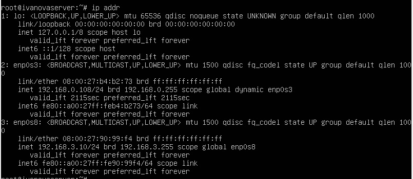
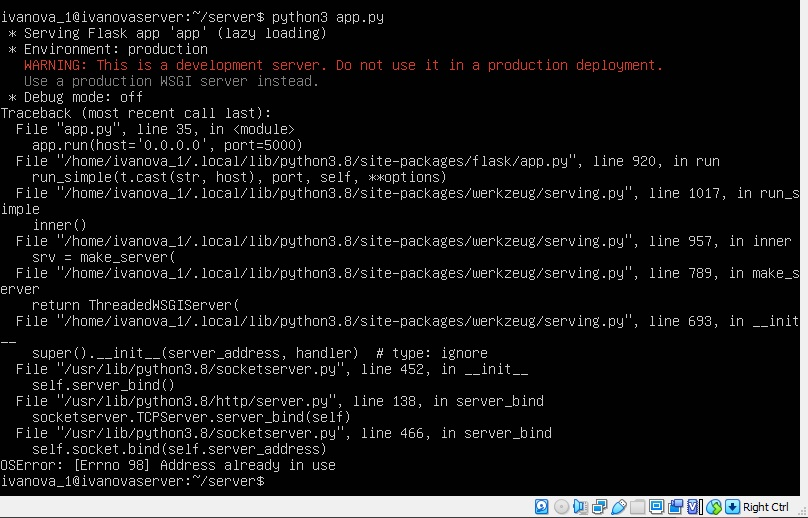
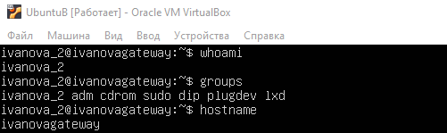
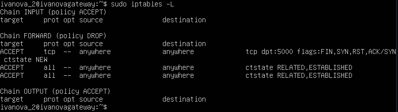
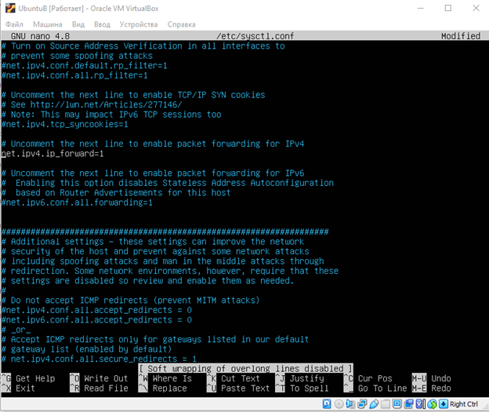
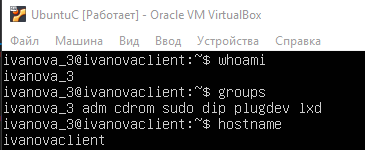
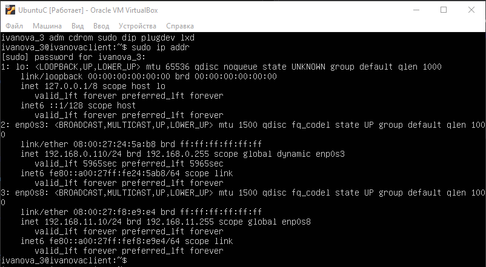

# Практическое задание №1. База Linux
В данной практической работе необходимо было развернуть 3 виртуальные машины, сконфигурировать и настроить их определенным образом

Работа выполнена с помощью Oracle VM VirtualBox и Ubuntu Server 20.04.4

# 1. Ubuntu A

Сперва был создан пользователь и сконфигурирован hostname:

Далее был сконфигурирован интерфейс с определенным ip:

Был развернут http сервер на порту 5000:

# 2. Ubuntu B

Созданый пользователь и hostname для второй машины:

Далее сконфигурировано 2 виртуальных интерфейса с разными ip:

Конфигурация запросов в Ubuntu B через порт 5000:

Разрешение на переброс пакетов:

# 3. Ubuntu C

Как и для двух предыдущих машин был создан пользователь и сконфигурирован hostname:

Далее был сконфигурирован интерфейс с определенным ip:

