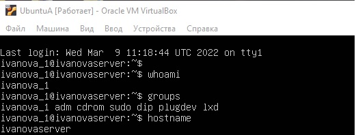

# Практическое задание №1. База Linux
В данной практической работе необходимо было развернуть 3 виртуальные машины, сконфигурировать и настроить их определенным образом

Работа выполнена с помощью Oracle VM VirtualBox и Ubuntu Server 20.04.4

# 1. Ubuntu A
Сперва был создан пользователь и сконфигурирован hostname 

Далее был сконфигурирован интерфейс с определенным ip

Был развернут http сервер на порту 5000

# 2. Ubuntu B
